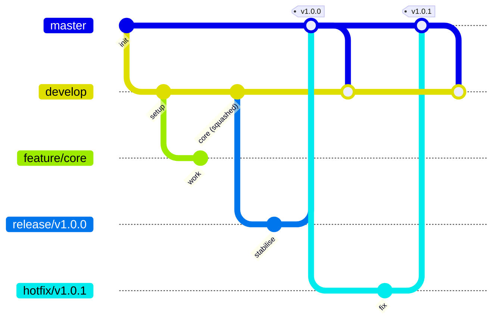

# CONTRIBUTING

This document provides all the information you would need to contribute to this repository: the branching workflow
and CI process, and the coding standards and best practices expected of a NinjaMonkeyGames project. Maintaining
quality and consistency across the codebase matters here as much as the process around it. If you have any
questions, please feel free to contact the repository owner — details provided in the footer.

---
<!-- markdownlint-disable MD013 -->
## TABLE OF CONTENTS

- [CONTRIBUTING](#contributing)
  - [TABLE OF CONTENTS](#table-of-contents)
  - [GitHub Workflow](#github-workflow)
    - [Branching Workflow](#branching-workflow)
      - [Permanent branches](#permanent-branches)
      - [Supporting branches](#supporting-branches)
      - [Naming conventions](#naming-conventions)
      - [Workflow](#workflow)
        - [Starting a feature](#starting-a-feature)
        - [Starting a release](#starting-a-release)
        - [Starting a hotfix](#starting-a-hotfix)
      - [Pull requests](#pull-requests)
      - [Closing issues](#closing-issues)
    - [Commit message requirements](#commit-message-requirements)
    - [Continuous integration checks](#continuous-integration-checks)
    - [Version control \& the `.yyp` file](#version-control--the-yyp-file)
    - [Code comment style](#code-comment-style)
  - [GameMaker Development](#gamemaker-development)
    - [Coding Standards \& Best Practices](#coding-standards--best-practices)
      - [1. Naming Conventions](#1-naming-conventions)
      - [2. Global Declarations](#2-global-declarations)
      - [3. Data Structures \& Syntax](#3-data-structures--syntax)
      - [4. Expressions \& Assignment](#4-expressions--assignment)
      - [5. Documentation \& Function Annotations](#5-documentation--function-annotations)
      - [6. Resource Management](#6-resource-management)
      - [7. Testing](#7-testing)
      - [8. Feather (static analysis)](#8-feather-static-analysis)
      - [9. Instance \& Scope Safety](#9-instance--scope-safety)
    - [Principles](#principles)
      - [1. The principle of Model-View-Controller (MVC) separation](#1-the-principle-of-model-view-controller-mvc-separation)
      - [2. The principle of defensive programming](#2-the-principle-of-defensive-programming)
      - [3. The principle of modularity](#3-the-principle-of-modularity)
      - [4. The principle of DRY code](#4-the-principle-of-dry-code)
      - [5. The principle of human-readable code](#5-the-principle-of-human-readable-code)
    - [Code sanity checks](#code-sanity-checks)
  - [CONTACT INFORMATION](#contact-information)
  - [COPYRIGHT](#copyright)
<!-- markdownlint-enable MD013 -->
---

## GitHub Workflow

Everything about how this repository uses git and GitHub: branching, commits, pull requests, CI, and the
repo's own Markdown/config conventions.

### Branching Workflow

This repository follows a Gitflow-style workflow, with one deliberate deviation from strict Gitflow: **feature branches
are squash-merged into `develop`**, rather than merged with a merge commit. Release and hotfix branches still merge
normally (a real merge commit), so `master`'s history and version tags stay intact.

It defines two permanent branches and several types of short-lived supporting branches, each with a specific purpose and
merge direction.

---

#### Permanent branches

| Branch    | Purpose                                                                                     |
| --------- | ------------------------------------------------------------------------------------------- |
| `master`  | Production-ready code only. Every commit on `master` is a release.                          |
| `develop` | Integration branch. Reflects the latest delivered development changes for the next release. |

Nobody commits directly to `master` or `develop`. All changes arrive via pull requests from supporting branches.

---

#### Supporting branches

| Branch  | From      | Merges into | Merge type   | Naming              | Purpose                          |
| ------- | --------- | ----------- | ------------ | ------------------- | -------------------------------- |
| Feature | `develop` | `develop`   | Squash merge | `feature/<name>`    | New or in-progress functionality |
| Release | `develop` | `master`    | Merge commit | `release/<version>` | Stabilise and prepare a release  |
| Hotfix  | `master`  | `master`    | Merge commit | `hotfix/<version>`  | Urgent production fixes          |

Squashing a feature branch collapses all of its commits into a single new commit on `develop`. That commit has no
merge-parent link back to `feature/<name>`, so the branch's individual commits do not appear in `develop`'s history —
only the squashed result does.

**Neither `release/*` nor `hotfix/*` ever merges into `develop` directly.** Both only ever merge _out_ to `master` via
pull request. `develop` picks up everything that lands on `master` — a release, a hotfix, or semantic-release's own
version-bump commit — exclusively through the automated sync pull request that `sync-master-to-develop.yaml` opens from
`master` into `develop` (see [Starting a release](#starting-a-release) / [Starting a hotfix](#starting-a-hotfix)).
Allowing a second, direct `release/*`/`hotfix/*` → `develop` path alongside that sync PR would risk the same commits
landing in `develop`'s history twice, so `check-source-branch` rejects any pull request that targets `release/*` or
`hotfix/*`, or that targets `develop` from anything other than `feature/*` or the sync PR's `master` head.



---

#### Naming conventions

- Feature branches: `feature/<short-description>` (e.g. `feature/login-page`)
- Release branches: `release/<version>` (e.g. `release/v1.1.0`)
- Hotfix branches: `hotfix/<version>` (e.g. `hotfix/v1.0.1`)

Versions follow [Semantic Versioning](https://semver.org/) (`vMAJOR.MINOR.PATCH`).

---

#### Workflow

##### Starting a feature

```text
git checkout develop
git pull origin develop
git checkout -b feature/<short-description>
```

Push the branch and open a pull request into `develop` when ready. **Squash merge** the pull request — GitHub's "Squash
and merge" option, or the CLI equivalent — so the feature lands on `develop` as one commit. Delete the feature branch
once merged.

##### Starting a release

When `develop` has enough features for a release:

```text
git checkout develop
git pull origin develop
git checkout -b release/<version>
```

Only bug fixes, documentation, and release-related chores (version bumps, changelog) belong on a release branch — no new
features.

While a release branch is open, any change that later lands on `master` (a hotfix, semantic-release's own version-bump
commit, anything) is merged into it automatically by `sync-master-to-develop.yaml` — see
[Starting a hotfix](#starting-a-hotfix) for how.

When the release branch is stable:

1. Open a pull request from `release/<version>` into `master`. Merging tags the resulting commit as `<version>`.
2. `sync-master-to-develop.yaml` automatically **opens** a pull request bringing that merge (and anything else new on
   `master`, including semantic-release's own version-bump commit) into `develop` as a regular merge commit, not squash.
   It does **not** merge that PR — a human still reviews and merges it, same as every other pull request in this repo.
   Merge it once it's ready so the fixes made during stabilisation aren't left behind.
3. Delete the release branch.

##### Starting a hotfix

For an urgent fix to production:

```text
git checkout master
git pull origin master
git checkout -b hotfix/<version>
```

When the fix is ready:

1. Open a pull request from `hotfix/<version>` into `master`. Merging tags the resulting commit as `<version>`.
2. `sync-master-to-develop.yaml` automatically **opens** a pull request bringing that merge into `develop` as a regular
   merge commit, not squash. It does **not** merge that PR — a human still reviews and merges it. Do this promptly so
   the fix is included in future releases.
3. The same workflow also **merges `master` directly into every currently open `release/*` branch**, with no pull
   request and no review gate before the merge lands — `release/*` branches can't receive an incoming PR at all (see
   [Pull requests](#pull-requests)), so a direct push, done automatically, is what closes the "an in-flight release
   can't ship without this fix either" gap. If `master` and a release branch have diverged in a way Git can't merge
   automatically, that branch is skipped and the workflow run fails loudly rather than silently — resolve it the same
   way you would by hand: check out the release branch, merge or rebase `master`'s changes onto it, resolve the
   conflict, and push directly.
4. Delete the hotfix branch.

---

#### Pull requests

- All merges into `master` or `develop` happen via pull request — no direct pushes.
- A pull request into `master` must come from a `release/*` or `hotfix/*` branch. Enforced by the `Branch Policy Check`
  required status check — see [Continuous integration checks](#continuous-integration-checks).
- `feature/*` → `develop` pull requests must be **squash merged**.
- `release/*` and `hotfix/*` pull requests must use a regular **merge commit** (not squash, not rebase) — this keeps
  `master`'s history and tags accurate. The same applies to the automated `master` → `develop` sync pull request, so the
  stabilisation commits it carries aren't collapsed away.
- Pull requests **into** `release/*` or `hotfix/*` are rejected outright by `check-source-branch` — these branches only
  ever merge _out_ (to `master`). Push fixes to them directly instead; see [Starting a release](#starting-a-release) /
  [Starting a hotfix](#starting-a-hotfix). This is also why keeping an open `release/*` branch in sync with `master` is
  a direct push rather than a pull request — see [Starting a hotfix](#starting-a-hotfix).
- Force-pushing is blocked on every branch **except** `feature/*` and `hotfix/*`, which stay open for rebasing or
  amending your own in-progress work.
- Keep feature branches short-lived and up to date with `develop` to avoid large, conflict-prone merges.

---

#### Closing issues

⚠️ **Caution:** merging into `develop` does **not** auto-close referenced issues, even with GitHub's usual
`Closes #123`-style keywords. GitHub only evaluates those keywords when a pull request merges into the repository's
**default branch** (`master`) — not `develop`.

Issues are therefore **closed manually** when merging a `feature/*` pull request, rather than automated. This is a
deliberate choice, not a limitation being worked around: closing issues by hand at merge time means actually reviewing
what a merge resolves, rather than trusting a keyword match.

Reference the issues a pull request addresses in its description (e.g. `References #123`) so there's a checklist to
close against at merge time, even though this reference will not trigger an automatic close.

---

### Commit message requirements

All commit messages, and `feature/*` → `develop` pull request titles and descriptions (squashing turns the PR title +
body into the actual commit message — see [Supporting branches](#supporting-branches)), must follow
[Conventional Commits](https://www.conventionalcommits.org/) as configured in `.config/commitlint.config.mjs`, with a
custom plugin at `.config/signed-off-by-regex.js`. Pull request titles and descriptions are actually checked against
`.config/commitlint.pr-message.config.mjs`, a thin wrapper around the same config — see the note on `Signed-off-by`
below for the one rule it changes.

Beyond the standard Conventional Commits format, this project requires:

- A **scope** from a fixed list: `core`, `api`, `ui`, `auth`, `db`, `deps`, `tests`, `config`, `security`, `rebase`.
- A **body** of at least 10 characters, in sentence case.
- A **`Signed-off-by: Name <email@example.com>`** line — a
  [Developer Certificate of Origin](https://developercertificate.org/)-style sign-off, not a cryptographically signed
  commit.

ℹ️ **Imperative mood is encouraged, not enforced.** Aim for subjects like "add X" / "fix Y" rather than "added X" /
"fixed Y" — read it as completing "This commit will ...". `.config/commitlint.config.mjs` has no rule checking this, and
isn't expected to gain one: reliably telling imperative from past-tense/gerund phrasing from a short subject line runs
into real ambiguity (irregular verbs, ordinary words that merely look like the wrong tense), so a linter here would end
up rejecting valid subjects about as often as it let bad ones through. Treat it as a style worth reaching for, not a
check you need to pass.

🔒 **Separately enforced by branch protection, not commitlint:** every commit, on every branch, must be
**cryptographically signed** (GPG or SSH) — this is a repository rule, checked at push time, not a commitlint rule. It's
a different requirement from the `Signed-off-by` line above: that's a DCO-style text trailer commitlint checks the
content of; this is a real cryptographic signature Git itself verifies. Configure commit signing locally (see
[GitHub's guide](https://docs.github.com/en/authentication/managing-commit-signature-verification)) or pushes will be
rejected outright, regardless of message content.

ℹ️ **Don't retype `Signed-off-by` into a `feature/*` → `develop` pull request description.** If your branch's commit
already carries a valid `Signed-off-by` trailer, GitHub auto-fills the PR description from that commit but strips the
trailer out of the auto-filled text — not because it's missing, but because GitHub recognises it as a git trailer and
re-attaches it to the final squash commit automatically from the source commit(s), regardless of what the description
says. Typing it into the description anyway doesn't add coverage (the commit already has it, and `preview / commitlint`
already lints that commit in full on every push); it only creates a second copy, which then shows up duplicated in the
"Squash and merge" button's editable commit message. This is why `.config/commitlint.pr-message.config.mjs` — used to
lint the PR title and description, see [Continuous integration checks](#continuous-integration-checks) — disables the
`signed-off-by` and `signed-off-by-regex` rules for that check specifically; every other rule in it is unchanged.

Example:

```text
feat(core): add player movement

Adds basic WASD movement to the player controller.

Signed-off-by: Jane Doe <jane@example.com>
```

---

### Continuous integration checks

Pushing to any branch, and opening a pull request into `develop` or `master`, trigger automated checks:

| Check                      | Runs on                          | What it checks                                       |
| -------------------------- | -------------------------------- | ---------------------------------------------------- |
| `preview / commitlint`     | Every push*                      | Latest commit (or range); see [requirements][cm]     |
| `preview / markdownlint`   | Every push*                      | Every Markdown file in the repo, `.config/` included |
| `preview / cspell`         | Every push*                      | Spelling across the repo, plus dotfiles (`--dot`)    |
| `preview / shellcheck`     | Every push*                      | Every `*.sh` file via `find`, `.config/` included    |
| `preview / eslint`         | Every push*                      | JS/TS and JSON/JSONC, `.config/eslint.config.js`     |
| `preview / gm-cli-tests`   | Every push*                      | Project's GameMaker test suite passes                |
| `preview / gm-cli-compile` | Every push*                      | Project compiles cleanly (linux target only)         |
| `lint-pr-message`          | feature/* → develop PRs          | Title/body, plus every commit's Signed-off-by        |
| `check-source-branch`      | PRs into 4 branches†             | Source branch is on the allow-list                   |
| `release`                  | Push to master/develop/release/* | Runs semantic-release when warranted                 |
| `sync`                     | Push to master                   | Opens develop sync PR; merges master into release/*  |

[cm]: #commit-message-requirements

\* Push to `feature/*`, `develop`, `release/*`, `hotfix/*`, or `master`.

† `master`, `develop`, `release/*`, or `hotfix/*`.

All seven `preview / *` checks also register a `preview` GitHub Deployment for the commit.

---

### Version control & the `.yyp` file

- Treat `.yyp`/`.yy` files as build output, not hand-edited prose: let the IDE make the change, don't hand-edit the
  JSON, and don't try to manually resolve a `.yyp` merge conflict by eyeballing it — GameMaker's own Source Control
  conflict tools (or a dedicated external merge tool) understand the file's structure in a way a plain text diff
  doesn't.
- Avoid two people adding, renaming, or reordering top-level assets (objects, rooms, scripts) at the same time — the
  `.yyp`'s own resource-order list is a single shared array, and simultaneous changes to it are one of the more
  common sources of GameMaker merge conflicts. Say so in the team channel before a large asset restructure.

---

### Code comment style

In source-code comments (`.mjs`, `.js`, `.sh`, `.yaml`, etc.), prefer backticks (`` ` ``) over single quotes (`'`) when
quoting an identifier, value, file path, or branch name — e.g. `` `feature/*` `` rather than `'feature/*'`. This matches
how this document quotes identifiers and keeps quoting consistent between prose and code.

---

## GameMaker Development

Everything about writing GML for this project itself — naming, style, structure, and the principles behind
them.

### Coding Standards & Best Practices

#### 1. Naming Conventions

- **Constants:** Must be declared in `UPPER_CASE`.
- **Local Variables:** Must be `lower_case` and prefixed with an underscore (e.g., `_player_health`).
- **Assets:** Must be in `snake_case` and prefixed with a prefix type code (e.g., `spr_player_idle`,
  `obj_enemy_boss`).

| Asset Type      | Prefix  | Example                |
|-----------------|---------|------------------------|
| Sprite          | `spr_`  | `spr_player_idle`      |
| Object          | `obj_`  | `obj_player`           |
| Room            | `rm_`   | `rm_level_one`         |
| Script          | `spt_`  | `spt_calculate_damage` |
| Sound/Audio     | `snd_`  | `snd_jump`             |
| Tile Set        | `ts_`   | `ts_forest_tiles`      |
| Font            | `fnt_`  | `fnt_main_menu`        |
| Shader          | `shd_`  | `shd_greyscale`        |
| Animation Curve | `acv_`  | `acv_jump_height`      |
| Sequence        | `seq_`  | `seq_player_death`     |
| Particle System | `ps_`   | `ps_fire_smoke`        |
| Time Source     | `tsrc_` | `tsrc_cooldown_timer`  |
| Path            | `pth_`  | `pth_enemy_patrol`     |

#### 2. Global Declarations

- Declare every global (`global.foo`) in one centralized, well-known place — e.g. a single controller object's Create
  event, or one dedicated init script — rather than scattering first-use declarations across the codebase. GML has no
  file-level scope to declare them at; `global.` variables can technically be created from anywhere, which is exactly
  why centralizing them is a convention worth enforcing.
- Functions may reference global variables but are prohibited from introducing new global symbols.
- Mark persistence deliberately: use a single persistent controller/manager instance (created once, e.g. in the
  project's first room) to survive room changes, rather than marking many individual gameplay objects `persistent`.
  Scattering the persistence flag around makes it hard to reason about what actually survives a room change.

#### 3. Data Structures & Syntax

- **MVC (Model-View-Controller):** This project follows the MVC architecture — see
  [The principle of Model-View-Controller (MVC) separation][mvc-principle] for what that means concretely in
  GameMaker terms.
- **Array Indexing:** Use bracket-nesting syntax exclusively: `array[x][y]`. Tuple-style indexing (e.g.,
  `array[x, y]`) is forbidden.
- **Ternary Operator:** Use `condition ? true_val : false_val` for concise conditional assignments.
- **Code Style:**
  - **Allman Style:** Braces must be on the next line for block structures.
  - **One-Liners:** APL (Allowed Per-Line) style is permitted only for trivial, short statements.
  - **Double equals:** Use `==` when comparing values.
- **Draw Events:** The Draw event must be reserved exclusively for rendering/drawing commands. It is strictly
  prohibited to place game logic, state calculations, or data processing within any Draw event.

  ℹ️ **One exception to this rule is for toggling draw on or off.**

[mvc-principle]: #1-the-principle-of-model-view-controller-mvc-separation

#### 4. Expressions & Assignment

- **No Magic Numbers:** Do not use literal numeric constants in game logic. Replace them with named constants using
  `#macro` or `enum` — GML's own two constant mechanisms, since it has no `const` keyword (e.g.,
  `#macro SPEED_MAX 120`).
- **Side-Effect Prohibition:** Don't bury an assignment or a function call that has side effects inside a larger
  expression, where it's easy to overlook.
  - _Bad:_ `if (list_add(my_list, item) > 0) { ... }` — the list mutation is hidden inside a condition.
  - _Bad:_ `total = get_score() + get_score();` — when `get_score()` has side effects, it's not obvious it's being
    called twice.
  - _Good:_ pull the call or assignment out onto its own line first, then use the result.
- **Object Instantiation:** All `new` calls must be assigned to a variable immediately. Anonymous instantiation is
  prohibited.
  - _Bad:_ `new Player();`
  - _Good:_ `var _player = new Player();`
- **Respect datatype structure:** Do not use `1` in place of `true`, nor `0` in place of `false`.

#### 5. Documentation & Function Annotations

- **JSDoc:** All functions must use the GameMaker JSDoc system for documentation (`@description`, `@param`, `@returns`,
  and friends) — see GameMaker's own [JSDoc manual page][jsdoc-manual].
- **Annotations:** Explicitly mark functions with `@pure` where applicable — a real Feather-recognized tag that marks
  a function as side-effect-free, which improves autocomplete/optimisation hints and documents intent for reviewers.
  Don't invent tags GameMaker doesn't recognize (e.g. there's no `@since` or `@version`); if you need changelog or
  version history for a function, put it in a regular comment or the commit history instead.
- **Comment Philosophy:** Comments should explain the intent ("why" this is done) rather than the mechanics ("what"
  the code does), as the code itself should be self-documenting through clear variable naming.

[jsdoc-manual]: https://manual.gamemaker.io/monthly/en/The_Asset_Editors/Code_Editor_Properties/JSDoc_Script_Comments.htm

#### 6. Resource Management

- Resources allocated manually (e.g. `ds_list_create`, `buffer_create`, `surface_create`) must be cleaned up in the
  corresponding Clean Up event. GameMaker's garbage collector only reclaims structs and arrays automatically once
  they're unreferenced — `ds_*` data structures, buffers, and surfaces each have their own destroy function and leak
  memory for the rest of the game's run if you don't call it yourself.
- Always check `if (ds_exists(_data, ds_type_list))` before calling `ds_list_destroy`.
- Prefer structs over `ds_map` for plain key-value data. GameMaker's own manual recommends this: "It is recommended
  to use structs over DS maps as they have similar features, are easier to use and are garbage collected
  automatically." Reach for `ds_map` only when you specifically need one of its own functions (e.g. saving/loading
  through `ds_map_secure_save`, or a built-in API that hands you one).

#### 7. Testing

- New or changed gameplay logic should get coverage in the project's GameMaker test suite where gm-cli's testing
  framework supports it — checked by `preview / gm-cli-tests` (see
  [Continuous integration checks](#continuous-integration-checks)). When something genuinely can't be tested that
  way, say so in the pull request description and how you verified it manually instead.

#### 8. Feather (static analysis)

- GameMaker's built-in static analysis system, Feather, flags likely mistakes — unreachable code, unused variables,
  type mismatches, and more — directly in the IDE as you write. Resolve Feather warnings before opening a pull
  request; don't leave them for a reviewer to catch by hand.
- If a warning is a genuine false positive, silence it with a `// Feather ignore once` directive naming the specific
  warning code (e.g. `// Feather ignore once GM1010`) — the narrowest scope Feather offers — rather than disabling
  it for the whole script or project, and leave a comment saying why it's safe to ignore.

#### 9. Instance & Scope Safety

- **Stored instance ids go stale:** If you cache another instance's id in a variable (a target, a parent reference,
  anything held across frames), that instance can be destroyed later and the stored id becomes invalid. Guard any
  later use of it with `instance_exists()` before reading or writing through it.
- **`with()` reassigns what `self` means:** Inside `with (other_instance) { ... }`, `self` refers to the targeted
  instance, not the instance that ran the `with` statement — `other` refers back to the original caller. Keep this
  straight, especially when nesting `with()` blocks.
- **No function calls as a `with()` assignment target:** A function call can't sit directly on the left-hand side of
  an assignment inside a `with` block.
  - _Bad:_ `instance_nearest(x, y, obj).speed = 0;` — this errors.
  - _Good:_ `(instance_nearest(x, y, obj)).speed = 0;`, or assign the result to a variable first.

### Principles

#### 1. The principle of Model-View-Controller (MVC) separation

This project follows the MVC pattern, mapped onto GameMaker's own event structure rather than treated as an
abstract idea:

- **Model:** the game's actual state — instance variables, structs, and the data owned by the persistent controller
  (see [Global Declarations](#2-global-declarations)). The Model doesn't know or care how it gets drawn.
- **View:** the Draw event, exclusively. This is the existing
  [Draw Events rule](#3-data-structures--syntax) stated in architectural terms: the View may only read the Model to
  render it, never compute new state.
- **Controller:** the Step event (and other logic events) — reads input, updates the Model, and decides what the
  View will have available to render, but never draws anything itself.

In practice: if you find yourself calculating a value inside a Draw event, or drawing something from inside a Step
event, that's an MVC violation as much as it is a Draw Events violation — the two rules are the same rule, just
named differently.

#### 2. The principle of defensive programming

All functions must be internally sanitised: they should robustly handle any input without causing an unhandled
exception.

#### 3. The principle of modularity

All code must be written with reuse in mind, in small, discrete units.

#### 4. The principle of DRY code

**DRY: don't repeat yourself. WET: write everything twice.**

- DRY code is clean code; WET code is messy code.
- DRY code is fast code; WET code is slow code.
- DRY code is readable code; WET code is confusing code.
- DRY code is efficient code; WET code is wasteful code.
- DRY code is professional code; WET code is sloppy code.
- DRY code is happy code; WET code is sad code.

#### 5. The principle of human-readable code

Micro-optimisations should not come at the expense of clean, human-readable code.

### Code sanity checks

Before committing, ask:

1. Are there any built-in GameMaker functions I can use to optimise this?
2. Have I optimised for performance?
3. Have I followed the design philosophy and coding rules?

---

## CONTACT INFORMATION

Author: Daniel Mallett (Monkey Knuckles)

If you have any problems with the repository or have any suggestions please contact us at <info@ninjamonkeygames.com>.

You may also contact us via our [website](https://ninjamonkeygames.com).

Any bugs should be raised as an [issue](https://github.com/NinjaMonkeyGames/gamemaker-project-template/issues) on
GitHub.

---

## COPYRIGHT

_NinjaMonkeyGames™ Copyright © 2026 All rights reserved._
